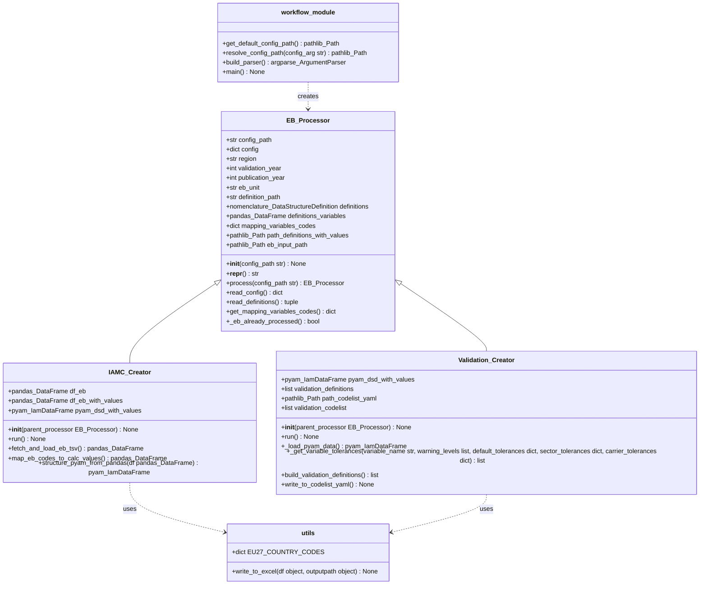

# Project Overview 

## Aim of the project 
- Gets the Eurostat Energy Balance either via the API or from data provided by the user, gets variable definitions from the config, and gets project configurations from the config folder  
- Calculates the values of the defined variables using the Eurostat Energy Balance as data basis and units defined in the variables definitions  
- Writes the output to an IAMC-formatted Excel file. 
- Uses the project configurations to create a nomenclature codelist to be used as a validation criterion in another repository. 
- Processes and writes out the validation criteria to a yaml file.

## Folder structure
└── eurostat-energy-balance_processing/
    ├── workflow.py
    ├── README.md
    ├── pixi.toml
    ├── .gitignore
    ├── .gitattributes
    ├── LICENSE
    ├── pyproject.toml
    ├── eurostat_energy_balance_processing/
    │   ├── workflow.py
    │   ├── class_definitions.py
    │   ├── utils.py
    │   └── __init__.py
    ├── tests/
    │   └── test_workflow_config.py
    └── configs/
        ├── config.default.yaml
    └── .github/
        └── copilot-instructions.md

## Mandatory operating rules 
- Prefer modifying existing modules over creating new files.
- Directly work in the files unless stated otherwise.
- Only create new files if no logical location exists.
- Never duplicate functionality already present in the package.
- Give a short overview of what you created afterwards in the chat.
- Before writing code, ask at least two clarification questions IF any of the following apply:
    - requirements are ambiguous
    - input/output format is unclear
    - multiple architectural choices exist
    - required files are missing or unclear
- use the conda-environment `pyam` to run statements with `conda activate pyam` 
- DO NOT use `pixi run` in comand-line statements, to run statements in the pixi environment of the project.

### Coding conventions
- Use type hints for all functions.
- Add docstrings in NumPy-style format
- Use pyam / pandas idioms instead of manual loops wherever possible 
- Use the folder structure and class-structure provided. If the code requires additional Classes, functions or class methods, create them after asking the user, if creating new structures is intended. The following class structure is intended (to be updated): 

### Follow-up questions  
- Ask whenever you are not sure about the goal of the task, any criteria, or strategy.  
- Distinguish between overall questions to a task and specific questions to resolve.  
- Always ask before performing command-line statements. 

## Task Completion Criteria
A task is complete when:
- Code runs without syntax errors.
- Tests pass or new tests are added and pass.
- New variables follow IAMC naming conventions.
- Changes are integrated into existing folder structure.
- A short summary of changes is provided.
- In chat mode: the user has reviewed the changes and given approval.
- For a pull-request: the user has to be reviewer of the pull request to give approval.

## Forbidden Actions
- Do NOT invent datasets, files, or APIs.
- Do NOT assume undocumented variables exist.
- Do NOT change any definitions in `definitions/`, or any statement in `configs/` unless explicitly asked for.
- Do NOT change folder structure unless explicitly requested.

## Testing Rules
- Add or update tests when behavior changes.
- Tests belong only in `/tests`.
- Prefer minimal unit tests over integration tests.

## Background Information
> [!WARNING]
> External documentation provides semantic guidance only. Local project conventions override external documentation.

- nomenclature-package: https://nomenclature-iamc.readthedocs.io/en/stable/
- pyam-package: https://pyam-iamc.readthedocs.io/en/stable/
- IAMC-format naming conventions: https://docs.ece.iiasa.ac.at/standards/variables.html
- Documentation of the Eurostat energy balance: https://ec.europa.eu/eurostat/documents/38154/4956218/ENERGY-BALANCE-GUIDE.pdf/de76d0d2-8b17-b47c-f6f5-415bd09b7750?t=1632139948586
